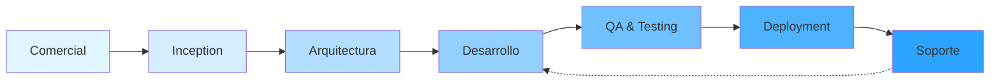

# ZΞNAPSΞS by ΛNWICO

## Minimalismo Estratégico Method

[](https://www.npmjs.com/package/awc-zns-mtd)
[](LICENSE)
[](https://nodejs.org)
[](https://www.npmjs.com/package/awc-zns-mtd)

## 🎯 Metodología de Transformación Digital: Minimalismo Estratégico

**ZΞNAPSΞS by ΛNWICO** es un framework avanzado de desarrollo y transformación digital basado en IA, diseñado para contextos empresariales hispanohablantes. Inspirado en BMAD Core V6, implementa una metodología estructurada que escala desde microservicios hasta arquitecturas empresariales complejas.

---

## 🏗️ Filosofía ZNS: Minimalismo Estratégico

**Máximo impacto con mínima complejidad**

### Principios Fundamentales

- **Esencialismo**: Solo lo necesario, nada superfluo
- **Enfoque láser**: Concentración en lo que realmente importa
- **Simplicidad deliberada**: Diseños claros sobre soluciones complejas
- **ROI de decisiones**: Cada elección debe justificar su existencia
- **Trazabilidad sin ruido**: Documentación precisa, no exhaustiva
- **Calidad predecible**: Procesos repetibles y validados
- Mejora continua

---

## ⚡ Características Principales

## 🤖 **Agentes Especializados (22 Total)**

### 🎯 **Core Team (4 agentes)**

- **zen-master** - Orquestador estratégico del método
- **product-owner-business-analyst** - Gestión de producto y análisis de negocio
- **solution-architect-senior** - Diseño de arquitectura escalable
- **cost-estimator-senior** - Estimación de esfuerzos y costos

### 💻 **Development Team (6 agentes)**

- **tech-lead-full-stack** - Liderazgo técnico
- **senior-backend-developer** - Desarrollo backend
- **senior-frontend-developer** - Desarrollo frontend
- **fullstack-developer** - Desarrollo full-stack
- **devops-cloud-engineer** - Infraestructura y CI/CD
- **database-specialist** - Diseño y optimización de bases de datos

### ✅ **QA & Testing (3 agentes)**

- **qa-test-automation-engineer** - Testing automatizado
- **security-specialist** - Auditorías de seguridad
- **performance-engineer** - Optimización de performance

### 📊 **Product & Strategy (4 agentes)**

- **technical-stories-architect** - Creación de user stories técnicas
- **ux-ui-designer** - Diseño de experiencia de usuario
- **data-analyst** - Análisis de datos y métricas
- **documentation-specialist** - Documentación técnica

### 🔧 **Support & Maintenance (5 agentes)**

- **support-engineer** - Soporte técnico post-lanzamiento
- **code-reviewer** - Revisión de código
- **refactoring-specialist** - Refactorización de código legacy
- **migration-expert** - Migraciones y upgrades
- **compliance-auditor** - Cumplimiento y regulaciones

**Todos los agentes están entrenados con metodología ZNS-MTD y trabajan de forma coordinada.**

---

## 🔄 **Workflows Completos del Método**

**ZΞNAPSΞS by ΛNWICO** cubre el **ciclo de vida COMPLETO** del proyecto, desde la **captación comercial** hasta el **soporte post-lanzamiento**:

### 1️⃣ **comercial-flow** - Flujo Comercial Completo

Gestiona desde la prospección hasta el contrato firmado:

- 📞 **Prospección:** Discovery meeting, análisis de viabilidad, GO/NO-GO
- 📄 **Oferta Técnica:** Arquitectura conceptual, product backlog inicial
- 💰 **Cotización:** Estimación de esfuerzos, costos, timeline
- ✍️ **Negociación:** Presentación al cliente, ajustes, firma de contrato

**Agentes involucrados:** `product-owner-business-analyst`, `cost-estimator-senior`, `solution-architect-senior`  
**Deliverables:** Oferta Comercial, Cotización Formal, Contrato

### 2️⃣ **inception-flow** - Arranque de Proyecto

Kickoff hasta el inicio del Sprint 1:

- 🚀 **Kickoff:** Alineación de equipo, herramientas, ceremonias
- 📋 **PRD Creation:** Product Requirements Document (20-40 páginas)
- 🗺️ **Backlog Breakdown:** User story mapping, estimación, priorización MoSCoW
- 🎯 **Release Planning:** Definición de MVP, roadmap, sprint 1 planning
- ✅ **Inception Review:** Review de deliverables, handoff a desarrollo

**Agentes involucrados:** `product-owner`, `solution-architect`, `technical-stories-architect`  
**Deliverables:** PRD completo, Arquitectura C4, 200-300 User Stories, Roadmap Visual

### 3️⃣ **analisis-flow** - Análisis Técnico Profundo _(En desarrollo)_

Análisis de proyectos existentes o auditorías técnicas.

### 4️⃣ **planificacion-flow** - Planning de Sprints _(En desarrollo)_

Gestión de sprints, roadmaps, releases.

### 5️⃣ **development-flow** - Implementación _(Roadmap)_

Desarrollo iterativo con mejores prácticas.

### 6️⃣ **qa-flow** - Testing y QA _(Roadmap)_

Aseguramiento de calidad integral.

### 7️⃣ **deployment-flow** - Despliegue _(Roadmap)_

CI/CD, staging, producción.

### 8️⃣ **support-flow** - Soporte y Mantenimiento _(Roadmap)_

Bug fixing, evolución, optimización.

---

## 🔄 Ciclo de Vida Completo del Proyecto

### Fase 0: **Comercial** - Captación y Oferta

- **Prospección:** Identificación de oportunidades
- **Oferta Técnica:** Propuesta de solución
- **Cotización:** Estimación de costos y timeline
- **Negociación:** Cierre comercial y firma

### Fase 1: **Inception** - Arranque Estratégico

- **Kickoff:** Alineación de equipo y objetivos
- **Discovery:** Workshops de requisitos
- **PRD Creation:** Product Requirements Document
- **Backlog:** User stories y priorización

### Fase 2: **Arquitectura** - Diseño Técnico

- **Solution Design:** Arquitectura de alto nivel
- **Tech Stack:** Selección de tecnologías
- **ADRs:** Architecture Decision Records
- **Infrastructure:** Definición de ambientes

### Fase 3: **Desarrollo** - Implementación Iterativa

- **Sprint Planning:** Planificación de iteraciones
- **Development:** Codificación con mejores prácticas
- **Code Review:** Revisión colaborativa
- **CI/CD:** Integración y deployment continuo

### Fase 4: **QA & Testing** - Aseguramiento de Calidad

- **Unit Testing:** Tests automatizados (>80% cobertura)
- **Integration Testing:** Pruebas de integración
- **UAT:** User Acceptance Testing
- **Performance:** Tests de carga y stress

### Fase 5: **Deployment** - Lanzamiento

- **Staging Deploy:** Despliegue a pre-producción
- **Production Deploy:** Lanzamiento controlado
- **Monitoring:** Observabilidad y alertas
- **Documentation:** Manuales técnicos y de usuario

### Fase 6: **Soporte** - Mantenimiento Continuo

- **Bug Fixing:** Corrección de errores
- **Feature Requests:** Nuevas funcionalidades
- **Performance Tuning:** Optimización
- **Security Patches:** Actualizaciones de seguridad



---

## 🚀 Instalación Rápida

### Requisitos Previos

- Node.js >= 18.0.0
- npm >= 9.0.0

### Instalación Global

```bash
# Instalar ZΞNAPSΞS globalmente desde NPM
npm install -g awc-zns-mtd

# Verificar instalación
zns --version
```

### Instalación Local (Desarrollo)

```bash
# Clonar repositorio
git clone https://github.com/awc/awc-zns-mtd.git
cd awc-zns-mtd

# Instalar dependencias
npm install

# Enlazar para desarrollo local
npm link
```

### Uso Básico

```bash
# Crear nuevo proyecto ZΞNAPSΞS
zns new mi-proyecto

# Inicializar estructura personalizada
zns init

# Ver estado del proyecto
zns status

# Validar configuración
zns validate
```

---

## 📋 Comandos y Workflows Principales

### 🏪 **Flujo Comercial** (Próximamente)

```bash
# Iniciar proceso comercial
zns comercial start

# Generar oferta técnica
zns comercial offer

# Crear cotización
zns comercial quote

# Gestionar negociación
zns comercial negotiate
```

### 🚀 **Inception & Planning** (Próximamente)

```bash
# Kickoff de proyecto
zns inception kickoff

# Crear PRD
zns create prd

# Generar backlog
zns inception backlog

# Planning de release
zns inception release-plan
```

### 🏗️ **Arquitectura & Diseño** (Próximamente)

```bash
# Crear especificación técnica
zns create techspec

# Documentar decisiones
zns create adr

# Diseño de arquitectura
zns architecture design
```

### 💻 **Desarrollo** (Próximamente)

```bash
# Análisis de código
zns analyze codebase

# Implementar feature
zns implement feature

# Refactorización
zns refactor

# Fix de bugs
zns fix bug
```

### ✅ **QA & Testing** (Próximamente)

```bash
# Revisión de código
zns review code

# Análisis de cobertura
zns test coverage

# Auditoría de seguridad
zns security audit
```

---

## 🎨 Arquitectura del Proyecto

```
ZΞNAPSΞS/
(awc-zns-mtd en NPM)
├── src/
│   ├── core/                 # Framework ZNS Core
│   │   ├── agents/          # Agentes base reutilizables (22 agentes)
│   │   ├── workflows/       # Workflows genéricos
│   │   └── tools/           # Herramientas del sistema
│   │
│   └── modules/
│       └── awc-zns-mtd/     # Módulo principal
│           ├── agents/      # 22 agentes especializados
│           ├── workflows/   # 8 workflows completos
│           │   ├── comercial-flow/      # ✅ Prospección → Contrato
│           │   ├── inception-flow/      # ✅ Kickoff → Sprint 1
│           │   ├── analisis-flow/       # ⏳ En desarrollo
│           │   ├── planificacion-flow/  # ⏳ En desarrollo
│           │   ├── development-flow/    # 📅 Roadmap
│           │   ├── qa-flow/             # 📅 Roadmap
│           │   ├── deployment-flow/     # 📅 Roadmap
│           │   └── support-flow/        # 📅 Roadmap
│           │
│           └── templates/   # Templates de documentos
│               ├── oferta-comercial.md
│               ├── PRD-template.md
│               ├── cotizacion.md
│               ├── discovery-notes.md
│               ├── viabilidad.md
│               ├── kickoff-agenda.md
│               └── arquitectura-conceptual.md
│
├── cli/
│   └── awc-agent-cli/      # CLI publicada en NPM
│       └── awc-agent.js    # Comandos: list, load, search, help
│
├── tools/
│   ├── schema/             # Validación YAML
│   └── version/            # Sistema de versiones
│
└── docs/                   # Documentación completa
```

---

## � Casos de Uso Reales

### 📊 **Caso 1: Startup Tech - MVP en 8 Semanas**

**Contexto:** Startup fintech necesita MVP para ronda de inversión.

**Workflows utilizados:**

1. `comercial-flow` → Oferta y cotización en 3 días
2. `inception-flow` → PRD y backlog en 2 semanas
3. `development-flow` → MVP funcional en 6 semanas

**Resultado:** MVP lanzado en tiempo, ronda de inversión exitosa ($2M), 15,000 usuarios en 3 meses.

---

### 🏢 **Caso 2: Empresa Legacy - Migración a Cloud**

**Contexto:** Empresa tradicional con sistema monolítico de 10 años migrando a microservicios en AWS.

**Workflows utilizados:**

1. `analisis-flow` → Auditoría técnica completa (2 semanas)
2. `inception-flow` → Roadmap de migración por fases
3. `development-flow` → Migración incremental (6 meses)
4. `deployment-flow` → Blue-green deployment sin downtime

**Resultado:** 99.9% uptime durante migración, reducción de costos 40%, escalabilidad 10x.

---

### 🚀 **Caso 3: E-commerce - Optimización para Black Friday**

**Contexto:** E-commerce con problemas de performance en picos de tráfico.

**Workflows utilizados:**

1. `analisis-flow` → Performance audit
2. `planificacion-flow` → Sprint planning para optimización
3. `qa-flow` → Load testing y stress testing
4. `deployment-flow` → Canary deployment

**Resultado:** Soportó 50,000 usuarios concurrentes (10x anterior), 0 downtime en Black Friday, +$3M en ventas.

---

## �📊 Estándares de Calidad

### No Negociables

- ✅ Cobertura de tests > 80%
- ✅ Deuda técnica < 5% del código
- ✅ Documentación sincronizada con código
- ✅ Code reviews obligatorios para producción

### Multi-Stack Support

- **Backend:** Java, .NET, Node.js, Python
- **Frontend:** React, Angular, Vue, Next.js
- **Cloud:** AWS, Azure, GCP
- **DevOps:** Docker, Kubernetes, CI/CD
- **Databases:** SQL, NoSQL, Graph

---

## 📚 Documentación

- [Guía de Inicio Rápido](docs/getting-started/quick-start.md)
- [Guía de Agentes](docs/guides/agents-guide.md)
- [Guía de Workflows](docs/guides/workflows-guide.md)
- [Referencia de API](docs/reference/api.md)
- [Ejemplos Prácticos](docs/examples/)

---

## 🤝 Contribución

Las contribuciones son bienvenidas. Por favor:

1. Fork el proyecto
2. Crea una rama para tu feature (`git checkout -b feature/AmazingFeature`)
3. Commit tus cambios (`git commit -m 'feat: Add AmazingFeature'`)
4. Push a la rama (`git push origin feature/AmazingFeature`)
5. Abre un Pull Request

---

## 📄 Licencia

Distribuido bajo licencia MIT. Ver `LICENSE` para más información.

---

## 🙏 Agradecimientos

- Inspirado en [BMAD Core V6](https://github.com/bmad-code-org/BMAD-METHOD)
- Basado en metodologías ágiles probadas
- Comunidad de desarrollo hispanohablante

---

## 📞 Contacto

**ΛNWICO Team**

**NPM Package:** [awc-zns-mtd](https://www.npmjs.com/package/awc-zns-mtd)  
**Project Link:** [https://github.com/awc/awc-zns-mtd](https://github.com/awc/awc-zns-mtd)

---

<div align="center">

### ZΞNAPSΞS by ΛNWICO

**Minimalismo Estratégico Method**

_Versión 2.9.0 - 8 de enero de 2026_

_Máximo impacto con mínima complejidad_

</div>
