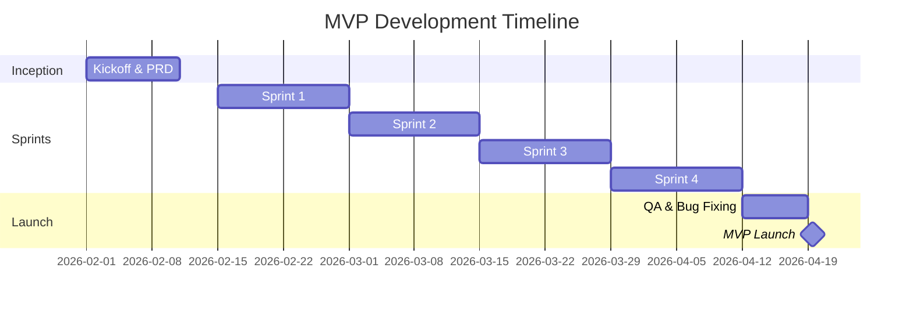

# Product Requirements Document (PRD)
## {Nombre del Proyecto}

**Versión:** {X.Y}  
**Fecha:** {DD/MM/AAAA}  
**Estado:** Draft | Review | Approved  
**Product Owner:** {Nombre del PO}  
**Stakeholders:** {Lista de stakeholders clave}

---

## 📋 Document Control

| Versión | Fecha | Autor | Cambios |
|---------|-------|-------|---------|
| 0.1 | {DD/MM/AAAA} | {Nombre} | Versión inicial |
| 0.2 | {DD/MM/AAAA} | {Nombre} | {Descripción de cambios} |
| 1.0 | {DD/MM/AAAA} | {Nombre} | Aprobación final |

### Aprobaciones

| Rol | Nombre | Firma | Fecha |
|-----|--------|-------|-------|
| Product Owner | {Nombre} | | |
| Tech Lead | {Nombre} | | |
| Cliente/Stakeholder | {Nombre} | | |

---

## 🎯 Executive Summary

{Resumen ejecutivo de 2-3 párrafos que explique qué es el producto, por qué es importante, y cuál es el valor que aporta al negocio. Este resumen debe ser comprensible para stakeholders no técnicos.}

### Elevator Pitch (30 segundos)
{Una frase de máximo 2 líneas que explique el producto de forma memorable}

### Quick Facts
- **Target Users:** {Tipo de usuarios principales}
- **Market Segment:** {Segmento de mercado}
- **Launch Target:** {Q1 2026 / Fecha específica}
- **Success Metric:** {Métrica principal de éxito}

---

## 🚀 Product Vision & Strategy

### Vision Statement
{Declaración visionaria de largo plazo - ¿Qué queremos lograr en 2-3 años?}

### Product Goals (OKRs)

#### Objetivo 1: {Nombre del Objetivo}
- **KR1:** {Key Result medible 1}
- **KR2:** {Key Result medible 2}
- **KR3:** {Key Result medible 3}

#### Objetivo 2: {Nombre del Objetivo}
- **KR1:** {Key Result medible 1}
- **KR2:** {Key Result medible 2}

#### Objetivo 3: {Nombre del Objetivo}
- **KR1:** {Key Result medible 1}
- **KR2:** {Key Result medible 2}

---

## 📊 Market Context & Problem Statement

### Current Situation
{Descripción detallada de la situación actual del mercado, competidores, y por qué existe la necesidad de este producto}

### Problem Statement
**WHO:** {Descripción del usuario/cliente objetivo}  
**WHAT:** {Descripción del problema que enfrentan}  
**WHY:** {Por qué es importante resolver este problema}  
**HOW:** {Cómo lo están resolviendo actualmente (workarounds)}

### User Pain Points
1. **{Pain Point #1}**  
   Severidad: 🔴 Crítico | 🟠 Alto | 🟡 Medio | 🟢 Bajo  
   Frecuencia: Diaria | Semanal | Mensual | Ocasional  
   {Descripción detallada}

2. **{Pain Point #2}**  
   Severidad: {Nivel}  
   Frecuencia: {Frecuencia}  
   {Descripción detallada}

3. **{Pain Point #3}**  
   Severidad: {Nivel}  
   Frecuencia: {Frecuencia}  
   {Descripción detallada}

---

## 👥 User Personas

### Persona 1: {Nombre del Persona} - {Rol}

**Demographics:**
- Edad: {Rango de edad}
- Rol: {Título del trabajo}
- Experiencia: {Nivel de expertise}
- Tech Savviness: Bajo | Medio | Alto

**Goals:**
- {Goal #1}
- {Goal #2}
- {Goal #3}

**Frustrations:**
- {Frustration #1}
- {Frustration #2}
- {Frustration #3}

**Day in the Life:**
{Descripción de un día típico de este usuario, cómo interactúa con sistemas similares}

**Quote:**
> "{Una frase típica que diría este usuario}"

---

### Persona 2: {Nombre del Persona} - {Rol}

{Repetir estructura de Persona 1}

---

## 🎯 Product Scope

### In Scope - MVP (Minimum Viable Product)

#### Epic 1: {Nombre de la Epic}
**Business Value:** {Por qué es importante esta epic}  
**Priority:** P0 (Must Have) | P1 (Should Have) | P2 (Nice to Have)

**User Stories:**
- **US-001:** Como {tipo de usuario}, quiero {acción} para {beneficio}  
  Criterios de Aceptación:
  - [ ] {Criterio 1}
  - [ ] {Criterio 2}
  - [ ] {Criterio 3}

- **US-002:** Como {tipo de usuario}, quiero {acción} para {beneficio}  
  Criterios de Aceptación:
  - [ ] {Criterio 1}
  - [ ] {Criterio 2}

#### Epic 2: {Nombre de la Epic}
{Repetir estructura de Epic 1}

#### Epic 3: {Nombre de la Epic}
{Repetir estructura de Epic 1}

---

### In Scope - Post-MVP (Future Phases)

#### Phase 2: {Nombre de la Fase}
- {Feature 1}
- {Feature 2}
- {Feature 3}

#### Phase 3: {Nombre de la Fase}
- {Feature 1}
- {Feature 2}

---

### Out of Scope
❌ **{Feature excluida #1}**  
Razón: {Por qué no se incluye}

❌ **{Feature excluida #2}**  
Razón: {Por qué no se incluye}

❌ **{Feature excluida #3}**  
Razón: {Por qué no se incluye}

---

## 🧩 Functional Requirements

### FR-001: {Nombre del Requisito}
**Priority:** P0 | P1 | P2  
**Epic:** {Epic relacionada}  
**User Story:** US-XXX

**Description:**  
{Descripción detallada del requisito funcional}

**Acceptance Criteria:**
- [ ] Given {contexto}, when {acción}, then {resultado esperado}
- [ ] Given {contexto}, when {acción}, then {resultado esperado}

**Dependencies:**  
Requiere: FR-XXX, FR-YYY

**UI/UX Notes:**  
{Wireframes, mockups, o descripción de la interfaz}

---

### FR-002: {Nombre del Requisito}
{Repetir estructura de FR-001}

---

## 🏗️ Non-Functional Requirements

### Performance Requirements

| ID | Requirement | Target | Measurement |
|----|-------------|--------|-------------|
| NFR-P-001 | Page Load Time | < 2 segundos | 95th percentile |
| NFR-P-002 | API Response Time | < 500 ms | Average |
| NFR-P-003 | Database Query Time | < 100 ms | 99th percentile |
| NFR-P-004 | Concurrent Users | 10,000 | Peak capacity |

### Security Requirements

| ID | Requirement | Implementation |
|----|-------------|----------------|
| NFR-S-001 | Authentication | OAuth 2.0 + JWT |
| NFR-S-002 | Authorization | RBAC (Role-Based Access Control) |
| NFR-S-003 | Data Encryption | AES-256 at rest, TLS 1.3 in transit |
| NFR-S-004 | Password Policy | Min 12 chars, complexity requirements |
| NFR-S-005 | Session Management | 30 min timeout, secure cookies |
| NFR-S-006 | Audit Logging | All critical actions logged |

### Scalability Requirements

| ID | Requirement | Target |
|----|-------------|--------|
| NFR-SC-001 | Horizontal Scaling | Auto-scale based on CPU/Memory |
| NFR-SC-002 | Database Scaling | Read replicas + sharding |
| NFR-SC-003 | Storage Growth | Support 1TB+ data |

### Availability & Reliability

| ID | Requirement | Target | Notes |
|----|-------------|--------|-------|
| NFR-A-001 | Uptime SLA | 99.9% | Max 8.7 hours downtime/year |
| NFR-A-002 | Recovery Time Objective (RTO) | < 1 hour | |
| NFR-A-003 | Recovery Point Objective (RPO) | < 15 minutes | |
| NFR-A-004 | Backup Frequency | Daily | Retained for 30 days |

### Usability & Accessibility

| ID | Requirement | Standard |
|----|-------------|----------|
| NFR-U-001 | Accessibility | WCAG 2.1 Level AA |
| NFR-U-002 | Browser Support | Chrome, Firefox, Safari, Edge (latest 2 versions) |
| NFR-U-003 | Mobile Responsive | Support screens 320px+ |
| NFR-U-004 | Internationalization | Spanish, English |

### Compliance & Legal

| ID | Requirement | Regulation |
|----|-------------|------------|
| NFR-C-001 | Data Privacy | GDPR compliant |
| NFR-C-002 | Data Residency | {País/Región específica} |
| NFR-C-003 | Audit Trail | SOC 2 Type II |

---

## 🎨 User Experience (UX)

### User Flows

#### Flow 1: {Nombre del Flujo Principal}
```
1. Usuario llega a {punto de entrada}
2. Usuario realiza {acción}
3. Sistema muestra {respuesta}
4. Usuario completa {objetivo}
```

{Incluir diagrama de flujo Mermaid o imagen}

#### Flow 2: {Nombre del Flujo Secundario}
{Repetir estructura}

---

### Wireframes & Mockups

#### Screen 1: {Nombre de la Pantalla}
{Descripción de la pantalla y sus componentes principales}

**Key Elements:**
- {Elemento 1}
- {Elemento 2}
- {Elemento 3}

{Incluir wireframe o referencia a Figma}

---

### Design Principles
1. **{Principio 1}:** {Descripción}
2. **{Principio 2}:** {Descripción}
3. **{Principio 3}:** {Descripción}

---

## 🏛️ Technical Architecture

### High-Level Architecture

```
{Diagrama C4 Level 1 (Context) y Level 2 (Containers)}
```

### Technology Stack

| Layer | Technology | Version | Justification |
|-------|------------|---------|---------------|
| Frontend | {React/Vue/Angular} | {X.Y} | {Por qué} |
| Backend | {Node.js/Java/Python} | {X.Y} | {Por qué} |
| Database | {PostgreSQL/MongoDB} | {X.Y} | {Por qué} |
| Cache | {Redis/Memcached} | {X.Y} | {Por qué} |
| Message Queue | {Kafka/RabbitMQ} | {X.Y} | {Por qué} |
| Storage | {S3/Azure Blob} | - | {Por qué} |
| CDN | {CloudFlare/Akamai} | - | {Por qué} |
| Infrastructure | {AWS/Azure/GCP} | - | {Por qué} |
| Container | {Docker/Kubernetes} | {X.Y} | {Por qué} |
| CI/CD | {Jenkins/GitHub Actions} | - | {Por qué} |
| Monitoring | {Datadog/New Relic} | - | {Por qué} |

### Third-Party Integrations

| Integration | Purpose | API Version | SLA |
|-------------|---------|-------------|-----|
| {Servicio 1} | {Propósito} | v{X} | {Uptime} |
| {Servicio 2} | {Propósito} | v{X} | {Uptime} |

---

## 📊 Success Metrics & KPIs

### Business Metrics

| Metric | Baseline | Target (3 months) | Target (6 months) | Measurement |
|--------|----------|-------------------|-------------------|-------------|
| {Métrica 1} | {Valor actual} | {Objetivo} | {Objetivo} | {Cómo se mide} |
| {Métrica 2} | {Valor actual} | {Objetivo} | {Objetivo} | {Cómo se mide} |

### Product Metrics

| Metric | Target | Definition |
|--------|--------|------------|
| Daily Active Users (DAU) | {X} | Usuarios únicos por día |
| Weekly Active Users (WAU) | {X} | Usuarios únicos por semana |
| Monthly Active Users (MAU) | {X} | Usuarios únicos por mes |
| Retention Rate (Day 1) | {X}% | % de usuarios que regresan al día siguiente |
| Retention Rate (Day 7) | {X}% | % de usuarios que regresan a la semana |
| Retention Rate (Day 30) | {X}% | % de usuarios que regresan al mes |
| Churn Rate | < {X}% | % de usuarios que abandonan |
| Feature Adoption Rate | > {X}% | % de usuarios que usan feature clave |

### Technical Metrics

| Metric | Target | Alert Threshold |
|--------|--------|-----------------|
| API Error Rate | < 0.1% | > 1% |
| P95 Response Time | < 500ms | > 2s |
| Uptime | 99.9% | < 99.5% |
| Failed Deployments | < 5% | > 10% |

---

## 📅 Roadmap & Timeline

### Phase 1: MVP (Weeks 1-8)



### Sprint Breakdown

#### Sprint 1 (Weeks 1-2)
**Goal:** {Objetivo del sprint}  
**Deliverables:**
- [ ] {Deliverable 1}
- [ ] {Deliverable 2}
- [ ] {Deliverable 3}

#### Sprint 2 (Weeks 3-4)
{Repetir estructura}

---

### Phase 2: Post-MVP (Months 3-6)
**Features:**
- {Feature 1}
- {Feature 2}
- {Feature 3}

### Phase 3: Scale & Growth (Months 7-12)
**Features:**
- {Feature 1}
- {Feature 2}

---

## ⚠️ Risks & Mitigation

| Risk | Probability | Impact | Mitigation Strategy | Owner |
|------|-------------|--------|---------------------|-------|
| {Riesgo #1} | Alta/Media/Baja | Alto/Medio/Bajo | {Estrategia} | {Responsable} |
| {Riesgo #2} | {Prob} | {Impact} | {Estrategia} | {Responsable} |
| {Riesgo #3} | {Prob} | {Impact} | {Estrategia} | {Responsable} |

---

## 📝 Assumptions & Constraints

### Assumptions
- {Asunción #1}
- {Asunción #2}
- {Asunción #3}

### Constraints
- **Technical:** {Restricción técnica}
- **Budget:** {Restricción presupuestaria}
- **Timeline:** {Restricción de tiempo}
- **Resources:** {Restricción de recursos}
- **Regulatory:** {Restricción legal/regulatoria}

---

## 🔄 Dependencies

| Dependency | Type | Owner | Due Date | Status |
|------------|------|-------|----------|--------|
| {Dependencia #1} | Internal/External | {Equipo} | {Fecha} | Not Started/In Progress/Done |
| {Dependencia #2} | {Tipo} | {Equipo} | {Fecha} | {Estado} |

---

## 📚 Appendix

### A. Glossary
| Term | Definition |
|------|------------|
| {Término 1} | {Definición} |
| {Término 2} | {Definición} |

### B. References
1. {Documento de referencia #1}
2. {Documento de referencia #2}
3. {Documento de referencia #3}

### C. Research & User Feedback
{Resumen de investigaciones, entrevistas de usuarios, encuestas, etc.}

### D. Competitive Analysis
{Análisis de competidores y productos similares}

---

## 📞 Document Ownership

**Product Owner:** {Nombre} ({email@empresa.com})  
**Technical Lead:** {Nombre} ({email@empresa.com})  
**Last Updated:** {DD/MM/AAAA}  
**Next Review Date:** {DD/MM/AAAA}

---

**Document Status:** ✅ Approved | 🔄 In Review | 📝 Draft

**Changelog:**
- {DD/MM/AAAA}: {Cambio realizado}
- {DD/MM/AAAA}: {Cambio realizado}
