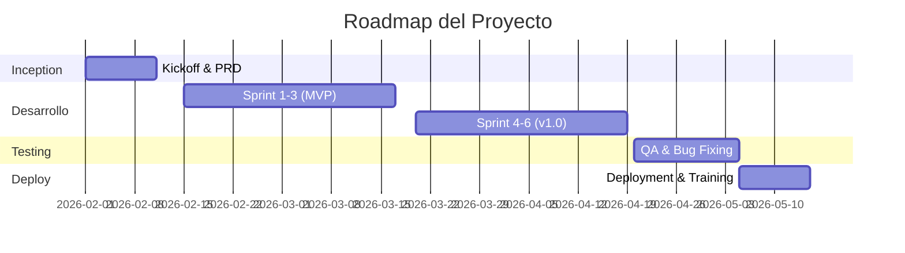

# Oferta Técnico-Comercial
## {Nombre del Proyecto}

**Cliente:** {Nombre del Cliente}  
**Fecha:** {DD/MM/AAAA}  
**Versión:** 1.0  
**Validez:** 30 días  
**Elaborado por:** {Nombre Consultor/Empresa}

---

## 📋 Resumen Ejecutivo

{Resumen de 2-3 párrafos explicando la oportunidad, la solución propuesta y el valor que aporta al cliente}

### Puntos Clave
- **Objetivo:** {Objetivo principal del proyecto}
- **Solución Propuesta:** {Descripción breve de la solución}
- **Duración Estimada:** {X semanas/meses}
- **Inversión:** ${XXX,XXX} USD
- **ROI Esperado:** {Descripción del retorno de inversión}

---

## 🎯 Contexto y Problemática

### Situación Actual del Cliente
{Descripción de la situación actual, pain points identificados, y por qué es necesario este proyecto}

### Objetivos del Negocio
1. {Objetivo de negocio #1}
2. {Objetivo de negocio #2}
3. {Objetivo de negocio #3}

### Métricas de Éxito (KPIs)
| KPI | Valor Actual | Objetivo | Impacto |
|-----|--------------|----------|---------|
| {KPI1} | {Baseline} | {Target} | {Descripción} |
| {KPI2} | {Baseline} | {Target} | {Descripción} |
| {KPI3} | {Baseline} | {Target} | {Descripción} |

---

## 💡 Solución Propuesta

### Descripción General
{Descripción detallada de la solución técnica propuesta, incluyendo cómo resuelve los pain points identificados}

### Componentes Principales
1. **{Componente 1}**  
   {Descripción breve}

2. **{Componente 2}**  
   {Descripción breve}

3. **{Componente 3}**  
   {Descripción breve}

### Arquitectura de Alto Nivel
```
{Incluir diagrama C4 Level 1 (Context) o arquitectura conceptual}
```

### Stack Tecnológico Propuesto
| Capa | Tecnología | Justificación |
|------|------------|---------------|
| Frontend | {React/Vue/Angular} | {Por qué esta tecnología} |
| Backend | {Java/Node/Python} | {Por qué esta tecnología} |
| Base de Datos | {PostgreSQL/MongoDB} | {Por qué esta tecnología} |
| Infraestructura | {AWS/Azure/GCP} | {Por qué esta tecnología} |
| DevOps | {Docker/Kubernetes} | {Por qué esta tecnología} |

---

## 📊 Alcance del Proyecto

### Funcionalidades Incluidas (In Scope)

#### Épica 1: {Nombre de la Épica}
- **RF-001:** {Requisito funcional 1}
- **RF-002:** {Requisito funcional 2}
- **RF-003:** {Requisito funcional 3}

#### Épica 2: {Nombre de la Épica}
- **RF-004:** {Requisito funcional 4}
- **RF-005:** {Requisito funcional 5}

#### Épica 3: {Nombre de la Épica}
- **RF-006:** {Requisito funcional 6}
- **RF-007:** {Requisito funcional 7}

### Requisitos No Funcionales

| ID | Requisito | Descripción | Prioridad |
|----|-----------|-------------|-----------|
| RNF-001 | Performance | Tiempo de respuesta < 2s para 95% de requests | Alta |
| RNF-002 | Seguridad | Autenticación OAuth 2.0 + JWT | Alta |
| RNF-003 | Escalabilidad | Soportar 10,000 usuarios concurrentes | Media |
| RNF-004 | Disponibilidad | Uptime de 99.9% | Alta |
| RNF-005 | Usabilidad | Cumplir WCAG 2.1 AA | Media |

### Fuera de Alcance (Out of Scope)
❌ {Funcionalidad explícitamente excluida #1}  
❌ {Funcionalidad explícitamente excluida #2}  
❌ {Funcionalidad explícitamente excluida #3}  
❌ {Funcionalidad explícitamente excluida #4}

> **Nota:** Cualquier requisito no listado en "In Scope" se considera fuera de alcance y requerirá una adenda al contrato.

---

## 🚀 Metodología y Enfoque

### AWC ZNS-MTD Method

Utilizaremos nuestra metodología probada **ZNS-MTD** (Zen • Neutro • Sistemático - Metodología de Transformación Digital):

- **Zen:** Enfoque claro y minimalista en la solución
- **Neutro:** Decisiones basadas en evidencia y mejores prácticas
- **Sistemático:** Procesos repetibles y documentación rigurosa

### Fases del Proyecto



### Ceremonias Agile
- **Daily Standup:** Lunes a Viernes, 15 min
- **Sprint Planning:** Cada 2 semanas, 2 horas
- **Sprint Review:** Cada 2 semanas, 1 hora
- **Retrospectiva:** Cada 2 semanas, 1 hora
- **Grooming:** Semanal, 1 hora

---

## 📅 Cronograma y Entregables

### Fase 1: Inception (2 semanas)
| Semana | Entregables |
|--------|-------------|
| S1 | Kickoff Meeting, Discovery Workshops |
| S2 | PRD Completo, Arquitectura Detallada, Backlog Priorizado |

### Fase 2: Desarrollo MVP (6 semanas)
| Sprint | Objetivo | Entregables |
|--------|----------|-------------|
| Sprint 1 | {Objetivo Sprint 1} | {Features entregadas} |
| Sprint 2 | {Objetivo Sprint 2} | {Features entregadas} |
| Sprint 3 | {Objetivo Sprint 3} | Demo de MVP funcional |

### Fase 3: Desarrollo v1.0 (6 semanas)
| Sprint | Objetivo | Entregables |
|--------|----------|-------------|
| Sprint 4 | {Objetivo Sprint 4} | {Features entregadas} |
| Sprint 5 | {Objetivo Sprint 5} | {Features entregadas} |
| Sprint 6 | {Objetivo Sprint 6} | Release Candidate v1.0 |

### Fase 4: QA y Deployment (3 semanas)
| Semana | Actividades |
|--------|-------------|
| S1 | Testing de integración, Corrección de bugs |
| S2 | Testing de aceptación (UAT), Performance testing |
| S3 | Deployment a producción, Capacitación usuarios |

---

## 👥 Equipo de Proyecto

### Equipo AWC (Nuestro Lado)
| Rol | Dedicación | Responsabilidades |
|-----|------------|-------------------|
| Product Owner | 50% | Gestión de backlog, priorización |
| Tech Lead / Arquitecto | 50% | Diseño técnico, code reviews |
| Senior Developer #1 | 100% | Desarrollo backend |
| Senior Developer #2 | 100% | Desarrollo frontend |
| QA Engineer | 75% | Testing, automatización |
| DevOps Engineer | 25% | CI/CD, infraestructura |

### Equipo Requerido del Cliente
| Rol | Dedicación | Responsabilidades |
|-----|------------|-------------------|
| Product Owner del Cliente | 25% | Validaciones, aprobaciones |
| Subject Matter Expert (SME) | 10% | Consultas de negocio |
| Usuario Final (Testing) | Ad-hoc | UAT, feedback |

---

## 🎯 Garantías y Compromisos

### Compromisos de Calidad
✅ Cobertura de tests automatizados > 80%  
✅ Code review obligatorio para todo código  
✅ Documentación técnica y de usuario  
✅ Cumplimiento de estándares de seguridad OWASP  
✅ Performance según requisitos no funcionales  

### Soporte Post-Lanzamiento
- **Garantía de bugs:** 90 días desde go-live
- **Soporte técnico:** Incluido durante 30 días
- **Capacitación:** 2 sesiones de 2 horas

---

## ⚠️ Riesgos y Mitigaciones

| Riesgo | Probabilidad | Impacto | Mitigación |
|--------|--------------|---------|------------|
| {Riesgo #1} | Media | Alto | {Estrategia de mitigación} |
| {Riesgo #2} | Baja | Medio | {Estrategia de mitigación} |
| {Riesgo #3} | Alta | Bajo | {Estrategia de mitigación} |

---

## 📚 Casos de Éxito Similares

### Proyecto Similar #1: {Nombre del Cliente/Industria}
- **Desafío:** {Descripción del desafío}
- **Solución:** {Descripción de la solución}
- **Resultado:** {Métricas de éxito alcanzadas}

### Proyecto Similar #2: {Nombre del Cliente/Industria}
- **Desafío:** {Descripción del desafío}
- **Solución:** {Descripción de la solución}
- **Resultado:** {Métricas de éxito alcanzadas}

---

## 💰 Inversión y Condiciones Comerciales

> **Ver documento adjunto:** [Cotización Comercial - {Nombre Proyecto}.pdf](./cotizacion.pdf)

### Resumen de Inversión
- **Costo Total:** ${XXX,XXX} USD
- **Esquema de Pagos:** Ver cotización adjunta
- **Forma de Pago:** Transferencia bancaria
- **Moneda:** USD / EUR / {Moneda local}

---

## 📞 Próximos Pasos

1. **Revisión de la Propuesta:** {Fecha límite para feedback}
2. **Sesión de Q&A:** Agendar reunión para resolver dudas
3. **Negociación Final:** Ajustes de alcance/costos si son necesarios
4. **Firma de Contrato:** Objetivo: {Fecha estimada}
5. **Kickoff Meeting:** Planificado para {Fecha estimada}

---

## 📄 Contacto

**{Nombre del Consultor/Empresa}**  
Email: {email@empresa.com}  
Teléfono: {+XX XXX XXX XXXX}  
LinkedIn: {linkedin.com/in/nombre}  
Web: {www.empresa.com}

---

**Documento Confidencial**  
Esta propuesta es confidencial y de uso exclusivo para {Nombre del Cliente}. Queda prohibida su reproducción o divulgación sin autorización previa por escrito.

---

**Validez de la Oferta:** 30 días desde la fecha de emisión  
**Versión del Documento:** 1.0  
**Fecha de Última Actualización:** {DD/MM/AAAA}
